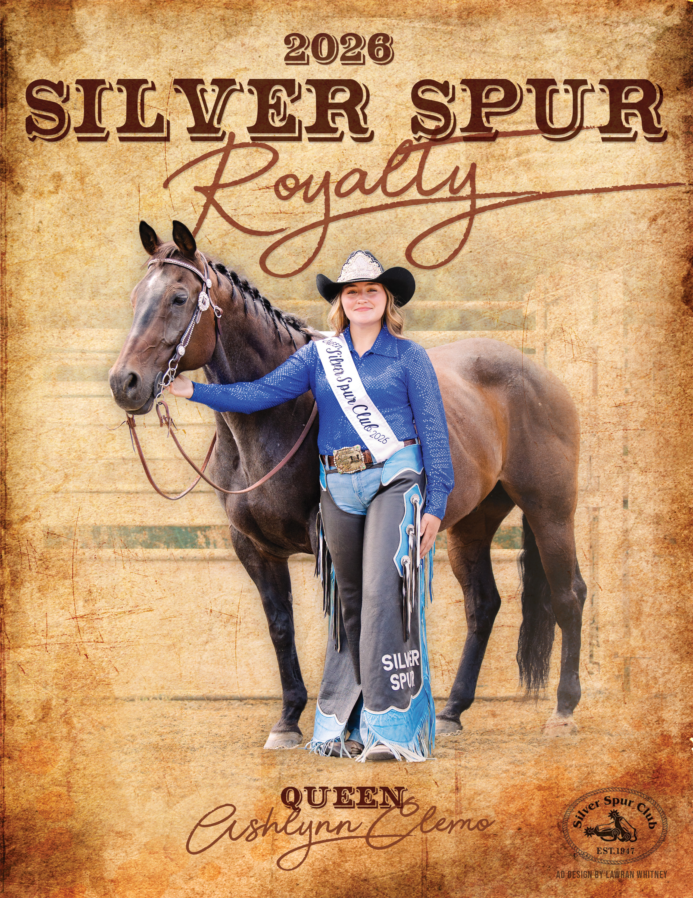

The Silver Spur Club organizes equestrian events in Kitsap County and holds multiple events per year at our outdoor arena and covered facility. Our club values competition, camaraderie, and growth for riders at every experience level.

Our members enjoy riding in our outdoor arena yearround, riding on the trails surrounding the outdoor arena, competing at events such as barrel races and game shows hosted by our club, and volunteering at our club-sponsored Junior Rodeo, as well as other events.

### Membership

Memberships to the Silver Spur Club are annual and should be renewed by January 01 each year. To join, please fill out [this form](https://www.cognitoforms.com/SilverSpurClub1/_2026SILVERSPURCLUBMEMBERSHIPAPPLICATION), where you can pay your dues using PayPal.

### Officers and Board

- Lan Taylor — President
- Jessica Sharpe — Vice President
- Erika Anderson — Secretary
- Cas Taylor — Treasurer
- Brittney Bell — Board Member
- Vera Brusseau — Board Member
- Carmen Farmer — Board Member
- Suzie Knight — Board Member
- Kelli Johnson — Board Member
- Heather Miller — Board Member
- Shannon Segerman — Board Member

### Royalty

Meet our current 2026 royalty.

{.royalty-photo fig-alt="2026 Silver Spur Queen Ashlynn Clemo"}

#### Past and Present Royalty

  <table class="royalty-table">
    <thead>
      <tr>
        <th scope="col">Year</th>
        <th scope="col">Name</th>
        <th scope="col">Position</th>
      </tr>
    </thead>
    <tbody id="royalty-table-body"></tbody>
  </table>

