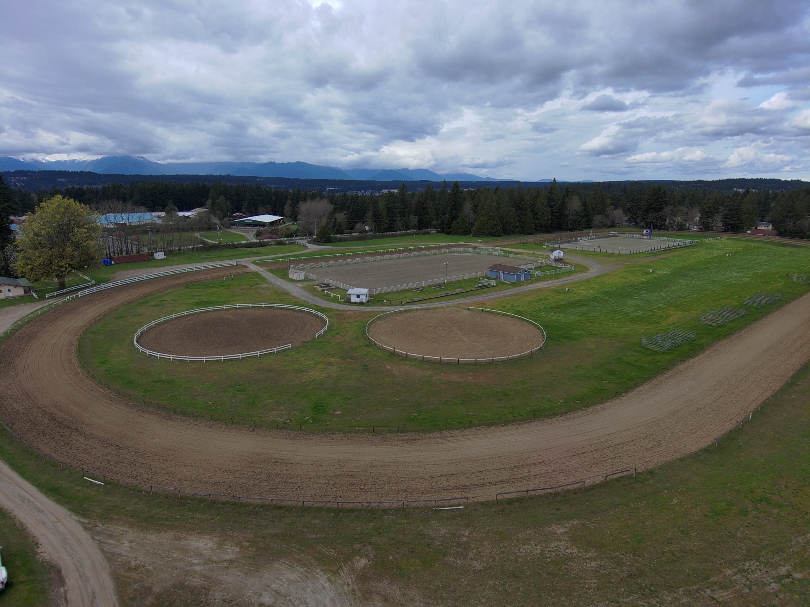

# Welcome to Silver Spurs

The Silver Spurs Club supports equestrian events and community activities in Kitsap County, Washington. Most of our events are hosted at our outdoor arenas ([8000 Nels Nelson Rd, Bremerton, WA](https://www.google.com/maps/search/?api=1&query=8000%20Nels%20Nelson%20Rd%2C%20Bremerton%2C%20WA)) and the Boand Arena ([7909 Nels Nelson Rd NW](https://www.google.com/maps/search/?api=1&query=7909%20Nels%20Nelson%20Rd%20NW%2C%20Bremerton%2C%20WA)). We welcome riders of all ages and levels and offer [detailed event results](results.qmd) on this website so competitors and fans can stay informed.

{.home-feature-image fig-alt="Silver Spurs Club riders at an event"}

For questions or membership information, please contact us through the club's email <a class="footer-link"  href="mailto:silverspurbarrelseries@gmail.com">(silverspurbarrelseries@gmail.com)</a>. You can become a member or renew your 2026 membership using [this form](https://www.cognitoforms.com/SilverSpurClub1/_2026SILVERSPURCLUBMEMBERSHIPAPPLICATION).

## Explore this site

- [About the Club](about/index.qmd)
- [Upcoming Events](events/index.qmd)
- [Event Results](results.qmd)

## Our Mission

Silver Spurs promotes safe, fun, and competitive equestrianevents in a welcoming environment. We support local riders, families, and the broader horse community through organized events.
