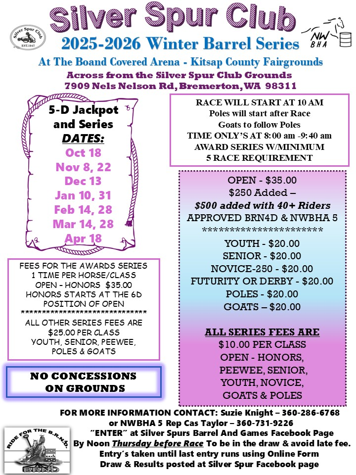
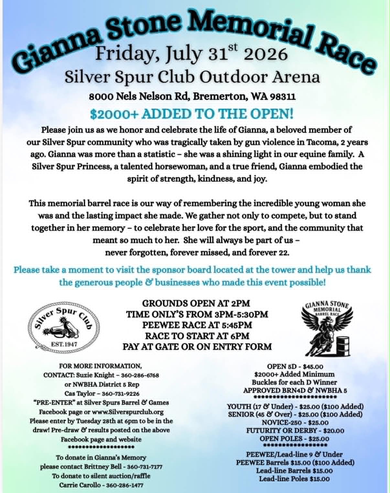
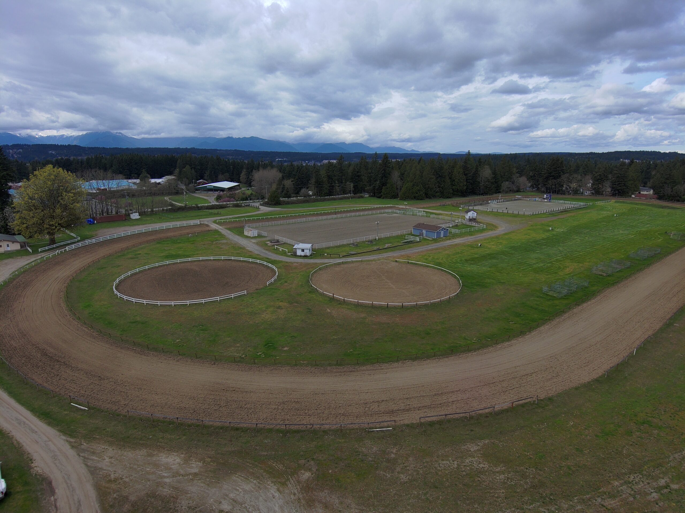

# Welcome to Silver Spurs

```{=html}
<div class="home-image-banner" aria-label="Featured Silver Spur events">
  <div class="home-image-track">
    <button class="home-banner-image-button" type="button" data-full-image="images/BoandWinterSeriesFlyer.jpg" data-full-image-alt="2025-2026 Boand Winter Series flyer">
      
    </button>
    <button class="home-banner-image-button" type="button" data-full-image="images/GiannaStoneMemorialRace.jpeg" data-full-image-alt="Gianna Stone Memorial Race flyer">
      
    </button>
    
    
  </div>
</div>

<div class="home-image-lightbox" id="home-image-lightbox" hidden>
  <button class="home-image-lightbox-close" type="button" aria-label="Close image">×</button>
  
</div>

<script>
(() => {
  const lightbox = document.getElementById('home-image-lightbox');
  const lightboxImage = document.getElementById('home-image-lightbox-image');
  const closeButton = lightbox.querySelector('.home-image-lightbox-close');

  const closeLightbox = () => {
    lightbox.hidden = true;
    lightboxImage.src = '';
    lightboxImage.alt = '';
  };

  document.querySelectorAll('.home-banner-image-button').forEach((button) => {
    button.addEventListener('click', () => {
      lightboxImage.src = button.dataset.fullImage;
      lightboxImage.alt = button.dataset.fullImageAlt;
      lightbox.hidden = false;
      closeButton.focus();
    });
  });

  closeButton.addEventListener('click', closeLightbox);
  lightbox.addEventListener('click', (event) => {
    if (event.target === lightbox) closeLightbox();
  });
  document.addEventListener('keydown', (event) => {
    if (event.key === 'Escape' && !lightbox.hidden) closeLightbox();
  });
})();
</script>
```

The Silver Spur Club supports equestrian events and community activities in Kitsap County, Washington. Most of our events are hosted at our outdoor arenas ([8000 Nels Nelson Rd, Bremerton, WA](https://www.google.com/maps/search/?api=1&query=8000%20Nels%20Nelson%20Rd%2C%20Bremerton%2C%20WA)) and the Boand Arena ([7909 Nels Nelson Rd NW](https://www.google.com/maps/search/?api=1&query=7909%20Nels%20Nelson%20Rd%20NW%2C%20Bremerton%2C%20WA)). We welcome riders of all ages and levels and offer [detailed event results](results.qmd) on this website so competitors and fans can stay informed.

{.home-feature-image fig-alt="Silver Spur Club riders at an event"}

For questions or membership information, please contact us through the club's email <a class="footer-link"  href="mailto:silverspurbarrelseries@gmail.com">(silverspurbarrelseries@gmail.com)</a>. You can become a member or renew your 2026 membership using [this form](https://www.cognitoforms.com/SilverSpurClub1/_2026SILVERSPURCLUBMEMBERSHIPAPPLICATION).

## Explore this site

- [About the Club](about/index.qmd)
- [Upcoming Events](events/index.qmd)
- [Event Results](results.qmd)

## Our Mission

Silver Spur promotes safe, fun, and competitive equestrian events in a welcoming environment. We support local riders, families, and the broader horse community through organized events.
